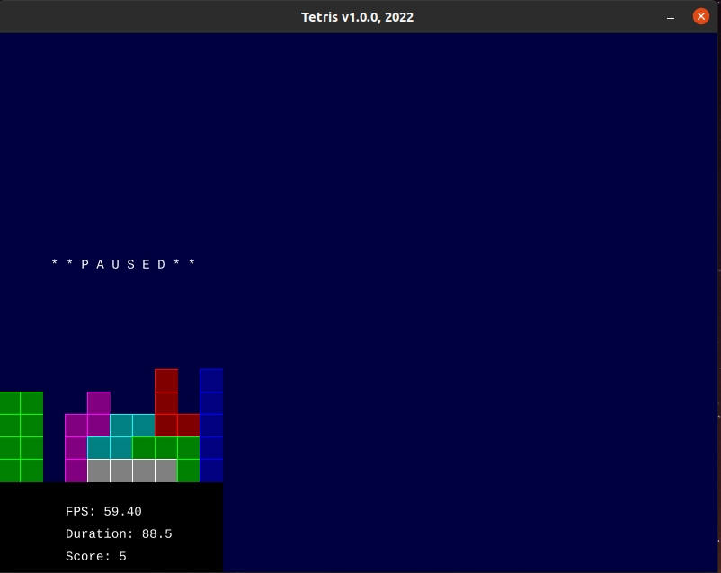

# Tetris v1

## Description

Based on the Borland C++ 4.52 (1995) Turbo Blocks game.

This the well known game Tetris.

Tetris is a puzzle video game created by Soviet software engineer Alexey Pajitnov in 1984.



## Dependencies

* [Good Web Game](https://github.com/ggez/good-web-game)


## Build and run

```
cargo build --release

cargo run --release
```

## Author

* [Antonio Soares](https://github.com/ccie18473)

## License

This project is licensed under the [MIT] License - see the LICENSE.md file for details

